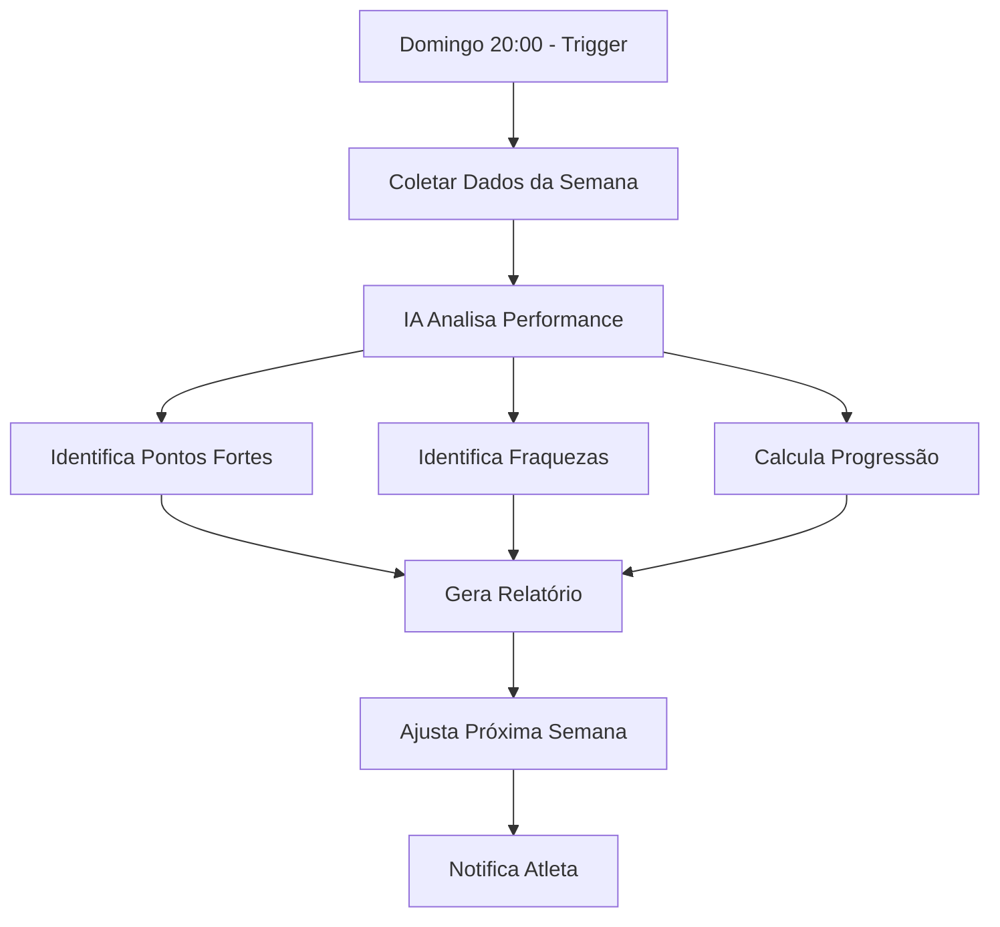

# 🤖 AI Model Selection & Evolutionary Programming

**CrossFit Health OS** - Análise de Modelos e Sistema Evolutivo

---

## 🎯 Modelos Disponíveis para Programming

### 1. **GPT-4 Turbo (OpenAI)** ⭐ RECOMENDADO

**Prós:**
- ✅ Melhor compreensão de contexto esportivo
- ✅ Output estruturado consistente (JSON mode)
- ✅ Excelente em seguir instruções complexas
- ✅ Grande conhecimento de CrossFit/metodologias
- ✅ Pode processar histórico de treinos (128K context)

**Contras:**
- ❌ Custo mais alto ($0.01/1K tokens input, $0.03/1K output)
- ❌ Latência ~5-10s por request

**Custo estimado por semana:**
- Input: ~3K tokens (contexto) = $0.03
- Output: ~5K tokens (programa completo) = $0.15
- **Total: ~$0.18 por programa semanal**

**Melhor para:** Programação inicial, ajustes complexos, análise de performance

---

### 2. **GPT-4o (OpenAI)** ⚡ MELHOR CUSTO-BENEFÍCIO

**Prós:**
- ✅ Mais rápido que GPT-4 Turbo (~3-5s)
- ✅ Custo 50% menor ($0.005/1K input, $0.015/1K output)
- ✅ Qualidade próxima ao GPT-4 Turbo
- ✅ 128K context window

**Contras:**
- ⚠️ Levemente menos criativo
- ⚠️ Pode ser mais verboso

**Custo estimado:** ~$0.10 por programa semanal

**Melhor para:** Uso diário, iterações rápidas

---

### 3. **Claude 3.5 Sonnet (Anthropic)** 🧠

**Prós:**
- ✅ Excelente raciocínio analítico
- ✅ Ótimo para revisão de dados e ajustes
- ✅ Muito bom em seguir instruções detalhadas
- ✅ 200K context (mais histórico)

**Contras:**
- ❌ Menos familiarizado com CrossFit específico
- ❌ Custo similar ao GPT-4 Turbo
- ⚠️ Pode ser conservador demais

**Custo estimado:** ~$0.15 por programa

**Melhor para:** Análise de performance, revisões semanais, ajustes finos

---

### 4. **Gemini 1.5 Pro (Google)** 💎

**Prós:**
- ✅ Context window MASSIVO (1M tokens)
- ✅ Pode processar meses de histórico de uma vez
- ✅ Custo baixo ($0.00125/1K input, $0.005/1K output)
- ✅ Grátis até certo volume

**Contras:**
- ❌ Menos consistente em JSON estruturado
- ❌ Qualidade inferior para tarefas criativas
- ⚠️ Latência variável

**Custo estimado:** ~$0.02-0.05 por programa (ou grátis)

**Melhor para:** Análise de longo prazo, trends, histórico massivo

---

### 5. **Claude 3 Opus (Anthropic)** 🏆 MÁXIMA QUALIDADE

**Prós:**
- ✅ Melhor modelo geral disponível
- ✅ Raciocínio superior para ajustes complexos
- ✅ Excelente compreensão de contexto
- ✅ Muito preciso

**Contras:**
- ❌ MUITO caro ($0.015/1K input, $0.075/1K output)
- ❌ Mais lento (~10-15s)

**Custo estimado:** ~$0.40 por programa

**Melhor para:** Atletas elite, ajustes críticos, casos complexos

---

## 🎯 Recomendação: Sistema Híbrido

### **Estratégia Otimizada:**

```
┌─────────────────────────────────────────┐
│ Geração Inicial (Segunda-feira)        │
│ Modelo: GPT-4o                          │
│ Custo: ~$0.10                           │
│ Tempo: ~5s                              │
└─────────────────────────────────────────┘
                 ↓
┌─────────────────────────────────────────┐
│ Ajustes Diários (Adaptativos)          │
│ Modelo: GPT-4o mini ($0.15/1M tokens)  │
│ Custo: ~$0.02/ajuste                    │
│ Tempo: ~2s                              │
└─────────────────────────────────────────┘
                 ↓
┌─────────────────────────────────────────┐
│ Revisão Semanal (Domingo)               │
│ Modelo: Claude 3.5 Sonnet               │
│ Custo: ~$0.15                           │
│ Tempo: ~8s                              │
└─────────────────────────────────────────┘
                 ↓
┌─────────────────────────────────────────┐
│ Análise Mensal (Trends)                 │
│ Modelo: Gemini 1.5 Pro                  │
│ Custo: ~$0.05                           │
│ Tempo: ~10s                             │
└─────────────────────────────────────────┘

CUSTO TOTAL MENSAL: ~$2-3 por atleta
```

---

## 📊 Dados Necessários para Programação Evolutiva

### 1. **Baseline (Setup Inicial)**

```json
{
  "user_profile": {
    "age": 32,
    "weight_kg": 80,
    "height_cm": 175,
    "training_age_years": 3,
    "fitness_level": "intermediate",
    "goals": ["strength", "conditioning", "lose_fat"],
    "training_frequency": 5,
    "available_equipment": ["barbell", "pull_up_bar", "rower"],
    "injuries": ["right_shoulder_impingement_2023"],
    "preferences": {
      "favorite_movements": ["deadlift", "box_jumps"],
      "hated_movements": ["burpees"],
      "preferred_session_length": 90
    }
  },
  "strength_baseline": {
    "back_squat_1rm": 140,
    "deadlift_1rm": 180,
    "bench_press_1rm": 100,
    "strict_press_1rm": 65,
    "snatch_1rm": 70,
    "clean_jerk_1rm": 95
  },
  "gymnastics_baseline": {
    "max_strict_pullups": 15,
    "max_kipping_pullups": 30,
    "can_muscle_up": true,
    "can_handstand_walk": false,
    "max_hspu": 10
  },
  "conditioning_baseline": {
    "fran_time": "4:32",
    "helen_time": "9:15",
    "mile_run_time": "6:45",
    "500m_row_time": "1:32"
  }
}
```

### 2. **Dados Diários (Tracking)**

```json
{
  "daily_metrics": {
    "date": "2026-02-08",
    "recovery": {
      "hrv_ms": 65,
      "resting_hr_bpm": 52,
      "sleep_hours": 7.5,
      "sleep_quality_score": 82,
      "stress_level": 3,
      "muscle_soreness": 4,
      "energy_level": 8,
      "mood": "good"
    },
    "readiness_score": 78
  }
}
```

### 3. **Dados de Sessão (Performance)**

```json
{
  "workout_session": {
    "date": "2026-02-08",
    "scheduled_workout_id": "uuid",
    "completed": true,
    "duration_actual_minutes": 92,
    "rpe_score": 8,
    
    "strength_performed": [
      {
        "movement": "back_squat",
        "prescribed": {"sets": 5, "reps": 5, "intensity": "80%"},
        "actual": {"sets": 5, "reps": [5,5,5,5,4], "weight_kg": [112,112,112,112,110]},
        "notes": "Last set too heavy, dropped to 110kg"
      }
    ],
    
    "metcon_performed": {
      "workout_name": "AMRAP 12min",
      "prescribed_rounds": "6-8",
      "actual_rounds": 7,
      "actual_reps": 3,
      "time_completed": 720,
      "movements": [
        {
          "movement": "thruster",
          "prescribed_weight_kg": 42.5,
          "actual_weight_kg": 42.5,
          "breaks": ["after_round_4", "after_round_6"],
          "notes": "Broke thrusters into 3-2 after round 4"
        }
      ]
    },
    
    "heart_rate": {
      "avg_bpm": 152,
      "max_bpm": 178,
      "time_in_zones": {
        "zone1": 300,
        "zone2": 600,
        "zone3": 1200,
        "zone4": 900,
        "zone5": 300
      }
    },
    
    "subjective_feedback": {
      "difficulty": "hard_but_manageable",
      "technique_quality": 8,
      "pacing": "good",
      "would_repeat": true,
      "notes": "Squats felt strong. MetCon was spicy but fun."
    }
  }
}
```

### 4. **Dados Semanais (Revisão)**

```json
{
  "weekly_review": {
    "week_number": 3,
    "methodology": "hwpo",
    "planned_sessions": 5,
    "completed_sessions": 5,
    "adherence_rate": 100,
    
    "volume_metrics": {
      "total_reps_strength": 487,
      "total_kg_moved": 45000,
      "total_metcon_minutes": 85,
      "avg_rpe": 7.4
    },
    
    "recovery_metrics": {
      "avg_hrv": 62,
      "avg_sleep_hours": 7.2,
      "avg_readiness": 75,
      "soreness_trend": "decreasing"
    },
    
    "performance_highlights": [
      {
        "movement": "back_squat",
        "improvement": "Increased working weight from 110kg to 112kg",
        "confidence": "high"
      },
      {
        "movement": "muscle_up",
        "improvement": "Completed all 6 sets unbroken for first time",
        "confidence": "medium"
      }
    ],
    
    "challenges": [
      {
        "movement": "handstand_walk",
        "issue": "Balance inconsistent, only completed 3/4 sets",
        "suggested_focus": "Increase volume next week"
      }
    ],
    
    "athlete_feedback": {
      "overall_satisfaction": 9,
      "difficulty_rating": "appropriate",
      "favorite_session": "friday_competition_wod",
      "least_favorite": "wednesday_recovery",
      "notes": "Felt great this week. Ready to push harder next week."
    }
  }
}
```

### 5. **Dados Mensais (Trends)**

```json
{
  "monthly_analysis": {
    "month": "2026-02",
    "total_sessions": 20,
    "adherence_rate": 95,
    
    "strength_progress": {
      "back_squat_1rm": {"start": 140, "end": 145, "change_pct": 3.6},
      "deadlift_1rm": {"start": 180, "end": 185, "change_pct": 2.8},
      "snatch_1rm": {"start": 70, "end": 73, "change_pct": 4.3}
    },
    
    "conditioning_progress": {
      "fran": {"start": "4:32", "end": "4:15", "improvement_seconds": 17},
      "500m_row": {"start": "1:32", "end": "1:29", "improvement_seconds": 3}
    },
    
    "body_composition": {
      "weight_kg": {"start": 80, "end": 79.2},
      "body_fat_pct": {"start": 15, "end": 14.1}
    },
    
    "injury_report": {
      "injuries": [],
      "minor_issues": ["right_elbow_tweak_week3"],
      "days_missed": 1
    },
    
    "volume_trends": {
      "total_kg_moved": 185000,
      "total_metcon_minutes": 340,
      "trend": "increasing_safely"
    }
  }
}
```

---

## 🔄 Sistema de Revisão Semanal (Weekly Review)

### Fluxo Completo



### Perguntas que a IA Responde

1. **Aderência:** "Completou todas as sessões? Por quê não?"
2. **Volume:** "Volume foi apropriado ou excessivo?"
3. **Recuperação:** "HRV/sono indicam over-reaching?"
4. **Performance:** "Quais movimentos melhoraram? Quais estagnaram?"
5. **Próxima Semana:** "Aumentar carga? Reduzir volume? Focar em quê?"

### Exemplo de Revisão Gerada

```markdown
# Revisão Semanal - Semana 3 (HWPO)

## 📊 Overview
- **Sessões completadas:** 5/5 (100%)
- **RPE médio:** 7.4/10
- **Readiness médio:** 75/100
- **Nota geral:** 9/10

## 💪 Pontos Fortes
1. **Back Squat:** Aumentou working weight de 110kg → 112kg (2%). Profundidade e técnica excelentes.
2. **Muscle-Ups:** Completou todos os sets unbroken pela primeira vez. Confiança crescente.
3. **Metcons:** Pacing melhorou significativamente. Menos breaks nos AMRAPs.

## ⚠️ Áreas de Atenção
1. **Handstand Walk:** Apenas 3/4 sets completos. Balance inconsistente.
   - **Ação:** Aumentar volume de prática na Semana 4 (10min skill work 3x/semana)
   
2. **Snatch:** Técnica ainda falha acima de 70%. Erros no turnover.
   - **Ação:** Reduzir peso para 60-65%, focar em complexos (hang + floor + OHS)

3. **Recuperação:** HRV levemente suprimido (62 vs baseline 68).
   - **Ação:** Semana 4 é deload. Reduzir volume 40%, manter intensidade.

## 📈 Progressão Detectada
- **Volume Total:** ↑ 8% vs Semana 2 (conforme planejado)
- **Força:** Back squat +2kg, Deadlift stable
- **Conditioning:** Fran benchmark -8s (4:40 → 4:32)

## 🎯 Plano Semana 4 (Deload)
**Objetivo:** Recuperação ativa, técnica, preparar Semana 5 (intensificação)

**Ajustes:**
- ✅ Reduzir sets/reps 40-50%
- ✅ Manter intensidades (% 1RM)
- ✅ Aumentar skill work (handstand, snatch drills)
- ✅ Adicionar mobilidade extra (shoulders, ankles)
- ✅ Conditioning leve (Zone 2 focus)

**Focus Movements:**
- Handstand walk (skill)
- Snatch technique (complexos leves)
- Core strength (GHD, planks)

## 💬 Feedback do Atleta
> "Felt great this week. Ready to push harder next week."

**Resposta do Coach (IA):**
Excelente trabalho! Sua progressão está no ritmo certo. Semana 4 será mais leve (deload), mas essencial para absorver as adaptações. Use essa semana para refinar técnica no snatch e praticar handstand walks. Semana 5 voltamos forte na intensificação! 💪

## 📅 Próxima Sessão
**Segunda-feira, 06:00**
- Light Squat Day (3x5 @ 70%)
- Snatch Drills (8x2 @ 60%)
- Easy MetCon (EMOM 16min - moderate)

---
*Gerado por AI Coach (Claude 3.5 Sonnet) em 2026-02-09*
```

---

## 🛠️ Implementação Técnica

### 1. Data Collection Pipeline

```python
# Coletar todos os dados da semana
weekly_data = {
    "sessions": db.get_sessions(user_id, week_start, week_end),
    "recovery_metrics": db.get_recovery_metrics(user_id, week_start, week_end),
    "strength_progress": calculate_strength_changes(user_id, week_number),
    "conditioning_benchmarks": get_benchmark_improvements(user_id, month),
    "athlete_feedback": db.get_weekly_feedback(user_id, week_number)
}
```

### 2. AI Review Prompt

```python
prompt = f"""
Você é um coach de CrossFit elite analisando a performance de um atleta.

DADOS DA SEMANA {week_number}:
{json.dumps(weekly_data, indent=2)}

PERFIL DO ATLETA:
{json.dumps(user_profile, indent=2)}

TAREFA:
1. Analise a performance da semana
2. Identifique 3 pontos fortes
3. Identifique 2-3 áreas de melhoria
4. Determine se volume/intensidade foram apropriados
5. Avalie recuperação (HRV, sono, readiness)
6. Calcule progressão desde baseline
7. Sugira ajustes para próxima semana

FORMATO DE SAÍDA:
{{
  "summary": "...",
  "strengths": [...],
  "weaknesses": [...],
  "recovery_status": "optimal|adequate|compromised",
  "volume_assessment": "appropriate|too_high|too_low",
  "progressions_detected": [...],
  "next_week_adjustments": {{
    "volume_change_pct": 0,
    "intensity_change": "maintain|increase|decrease",
    "focus_movements": [...],
    "special_notes": "..."
  }},
  "coach_message": "Mensagem motivacional e específica"
}}
"""
```

### 3. Aplicar Ajustes Automaticamente

```python
async def apply_review_adjustments(review_result, next_week_number):
    """
    Aplica ajustes sugeridos pela revisão na próxima semana
    """
    adjustments = review_result["next_week_adjustments"]
    
    # Gerar nova programação com ajustes
    next_week_program = await ai_programmer.generate_weekly_program(
        user_profile=user_profile,
        methodology=methodology,
        week_number=next_week_number,
        focus_movements=adjustments["focus_movements"],
        volume_modifier=1 + (adjustments["volume_change_pct"] / 100),
        intensity_modifier=adjustments["intensity_change"],
        previous_week_data=weekly_data  # IA usa isso para progressão!
    )
    
    return next_week_program
```

---

## 📊 Métricas de Sucesso

### KPIs para Avaliar o Sistema

1. **Aderência:** % sessões completadas vs planejadas
2. **Satisfação:** Nota atleta 1-10
3. **Progressão:** Δ strength, Δ conditioning benchmarks
4. **Recuperação:** HRV trend, injury rate
5. **Retenção:** % atletas que continuam após 12 semanas

### Targets

- Aderência: >85%
- Satisfação: >8/10
- Progressão: >3% ao mês (iniciantes), >1% (avançados)
- Injury rate: <5%
- Retenção: >80%

---

## 💰 Custo-Benefício

### Investimento Mensal (por atleta)

| Modelo | Uso | Custo/mês |
|--------|-----|-----------|
| GPT-4o | 4 programas semanais | $0.40 |
| GPT-4o mini | 20 ajustes diários | $0.40 |
| Claude 3.5 | 4 revisões semanais | $0.60 |
| Gemini Pro | 1 análise mensal | $0.05 |
| **TOTAL** | | **~$1.45/atleta/mês** |

**ROI:**
- Subscription: $30-50/mês
- Custo IA: $1.45
- **Margem: 97%+**

---

## 🚀 Recomendação Final

### **Setup Ideal:**

1. **Geração de Programas:** GPT-4o (melhor custo-benefício)
2. **Revisão Semanal:** Claude 3.5 Sonnet (análise superior)
3. **Análise Mensal:** Gemini 1.5 Pro (histórico massivo grátis)
4. **Ajustes Rápidos:** GPT-4o mini (barato e rápido)

### **Dados Críticos:**

✅ **Mínimo Viável:**
- Sessões completadas vs planejadas
- RPE por sessão
- Feedback subjetivo atleta

✅ **Ideal:**
- + HRV, sono, readiness diários
- + Pesos/reps/tempo reais
- + Notas sobre técnica/pacing

✅ **Excelência:**
- + Wearable data (HR zones, calorias)
- + Vídeos para análise de movimento
- + Nutrição tracking

---

**Próximo passo:** Implementar sistema de revisão semanal?
