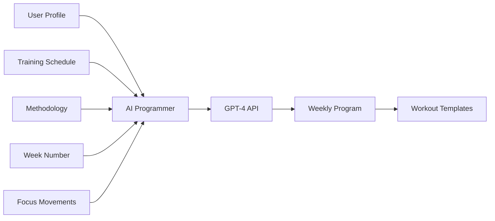

# 🤖 AI-Powered Training Programming Guide

**CrossFit Health OS** - Intelligent Training Program Generation

---

## 🎯 Overview

O sistema agora gera programas de treino completos usando **IA (GPT-4)**, inspirado nas metodologias **HWPO (Mat Fraser)**, **Mayhem (Rich Froning)**, e **CompTrain (Ben Bergeron)**.

### 🧠 Como Funciona



**Inputs:**
- Perfil do usuário (nível, peso, objetivos, fraquezas)
- Metodologia (HWPO, Mayhem, CompTrain, Custom)
- Dias de treino e durações
- Número da semana (progressão)
- Movimentos prioritários (opcional)
- Dados da semana anterior (opcional)

**Output:**
- Programação completa da semana
- Workouts evolutivos
- Instruções detalhadas (séries, reps, intensidade)
- Warm-up e cooldown
- Opções de scaling

---

## 📋 System Prompt (AI Coach)

O AI é treinado com este prompt de sistema:

```
You are an elite CrossFit programming coach with expertise in:
- HWPO (Mat Fraser methodology)
- Mayhem (Rich Froning methodology)
- CompTrain (Ben Bergeron methodology)

Your role:
1. Create progressive training programs (volume cycles, deload, progressive overload)
2. Balance strength, metcon, gymnastics, conditioning
3. Adapt to athlete's level, weaknesses, goals
4. Consider session duration (short ≤60min, long >60min)
5. Provide clear coaching cues

Programming Philosophy:
- Week 1-3: Volume accumulation
- Week 4: Deload/Active recovery
- Week 5-7: Intensity phase
- Week 8: Test week

Session Structure:
**Short (≤60min):**
- Warm-up: 10min
- Skill/Strength: 15-20min (1-2 movements)
- MetCon: 15-20min
- Cooldown: 5min

**Long (>60min):**
- Warm-up: 15min
- Strength: 30min (3-4 movements, multiple sets)
- Accessory: 15min
- MetCon: 20-25min
- Cooldown: 10min

Movement Selection:
- Compound lifts (squat, deadlift, press, olympic)
- Gymnastics (pull-ups, handstands, muscle-ups)
- Balance push/pull, squat/hinge
- Address weaknesses

Intensity:
- Strength: 70-90% 1RM
- MetCon: 75-85% max effort
- Conditioning: 60-75% (Zone 2-3)
- Skill: Quality over fatigue
```

---

## 🚀 API Usage

### Endpoint

**POST** `/api/v1/schedule/weekly/generate-ai`

### Request Body

```json
{
  "methodology": "hwpo",
  "week_number": 3,
  "focus_movements": ["snatch", "handstand_walk"],
  "include_previous_week": true
}
```

### Query Parameters (Optional)

- `schedule_id` (UUID) - Use specific schedule. If omitted, uses active schedule.

### Response

```json
{
  "status": "success",
  "message": "Generated 5 AI-powered workouts for week 3",
  "methodology": "hwpo",
  "week_number": 3,
  "training_days": ["monday", "tuesday", "wednesday", "thursday", "friday"],
  "workouts": [
    {
      "id": "uuid",
      "name": "Heavy Squat + Short AMRAP",
      "description": "Focus on building squat strength with accessory work",
      "workout_type": "strength",
      "duration_minutes": 90,
      "movements": [
        {
          "movement": "back_squat",
          "sets": 5,
          "reps": 5,
          "intensity": "80% 1RM",
          "rest": "3min",
          "notes": "Focus on depth and speed out of the hole"
        },
        {
          "movement": "bulgarian_split_squat",
          "sets": 3,
          "reps": 10,
          "intensity": "Bodyweight + 20kg DB",
          "rest": "90s",
          "notes": "Per leg, control the descent"
        },
        {
          "movement": "thruster",
          "reps": 5,
          "weight_kg": 42.5,
          "notes": "Part of AMRAP 12min"
        }
      ],
      "target_stimulus": "Leg strength + lactate tolerance",
      "tags": ["week_3", "ai_hwpo", "strength"]
    }
  ],
  "note": "Workouts saved to workout_templates. Schedule them in your weekly calendar."
}
```

---

## 📖 Example Programs

### HWPO Week 1 (Accumulation)

**Context:**
- Intermediate athlete
- 80kg bodyweight
- Goals: Strength + conditioning
- Weakness: Olympic lifts
- Training: Monday, Wednesday, Friday (90min each)

**AI-Generated Program:**

#### Monday - Heavy Squat Day
```
Duration: 90min
Type: Strength

Warm-up (15min):
- Row 500m easy
- 2 rounds: 10 air squats, 10 PVC pass-throughs, 5 inchworms
- Squat mobility: 10 goblet squats, 10 cossack squats

Strength (35min):
1. Back Squat
   - 5x5 @ 80% 1RM
   - Rest: 3min between sets
   - Focus: Depth, speed out of hole

2. Bulgarian Split Squat
   - 3x10 per leg @ BW + 20kg DB
   - Rest: 90s
   - Control descent, drive through heel

Accessory (15min):
3. Hamstring Curls
   - 3x15 @ moderate weight
   - Rest: 60s

MetCon (15min):
AMRAP 12min:
- 5 Thrusters (42.5kg)
- 10 Burpee Box Jumps (24")
- 15 Cal Row

Target: 5-7 rounds
Pacing: Steady, unbroken thrusters

Cooldown (10min):
- Easy bike 5min
- Foam roll: quads, hamstrings, glutes
- Couch stretch 2min per side
```

#### Wednesday - Olympic + Gymnastics
```
Duration: 90min
Type: Mixed

Warm-up (15min):
- 400m jog
- 3 rounds: 5 snatch grip deadlifts (empty bar), 10 scap pull-ups, 5 wall walks

Skill/Strength (40min):
1. Snatch Complex (focus movement)
   - 5x3 @ 60% 1RM
   - Complex: Hang Power Snatch + Power Snatch + Overhead Squat
   - Rest: 2min
   - Coaching: Fast elbows, catch high

2. Muscle-Up Practice
   - 10x2 strict muscle-ups
   - Rest: 90s
   - Or: Ring transition drills if not proficient

MetCon (20min):
For Time (15min cap):
- 21-15-9:
  - Power Snatch (35kg)
  - Chest-to-bar Pull-ups
  - Handstand Push-ups

Scaling:
- Snatch: reduce weight
- C2B: regular pull-ups
- HSPU: push-ups to box

Cooldown (15min):
- Row 1000m easy
- Shoulder mobility
- Stretch lats, triceps
```

#### Friday - Conditioning Focus
```
Duration: 90min
Type: Conditioning

Warm-up (10min):
- Bike 5min easy
- 2 rounds: 10 air squats, 10 push-ups, 10 sit-ups

Engine Builder (60min):
E3MOM for 15 rounds (45min total):
Minute 1: 15 Cal Bike @ 85%
Minute 2: 12 Burpees
Minute 3: 400m Run

Target stimulus: Aerobic threshold, sustainable pace

Accessory (15min):
3 rounds for quality:
- 20 GHD Sit-ups
- 15 Back Extensions
- 10 Hanging Knee Raises

Cooldown (5min):
- Walk 400m
- Static stretching
```

---

### Mayhem Week 5 (Intensification)

**Context:**
- Advanced athlete
- Training: Mon/Tue/Wed/Fri/Sat (60-90min)
- Focus: Competition prep
- Weakness: High-rep barbell cycling

**Sample Day (Tuesday - Volume Day):**

```
Duration: 90min
Type: Mixed

AM Session:
Strength (30min):
1. Deadlift
   - Build to heavy 3 @ RPE 8
   - Then: 3x3 @ 90% of heavy 3
   - Rest: 3min

2. Strict Press
   - 4x6 @ 75% 1RM
   - Rest: 2min

PM Session (or continue):
Barbell Cycling Practice (20min):
EMOM 10min:
- 10 Touch-and-go Power Cleans (60kg)
Goal: Unbroken, fast cycling

MetCon (20min):
"The Seven" (Hero WOD)
7 rounds for time:
- 7 Handstand Push-ups
- 7 Thrusters (60kg)
- 7 Knees-to-elbows
- 7 Deadlifts (110kg)
- 7 Burpees
- 7 KB Swings (32kg)
- 7 Pull-ups

Target: Sub 25min

Cooldown:
- Easy bike 10min
- Mobility work
```

---

### CompTrain Week 4 (Deload)

**Context:**
- Week 4 = Active recovery
- Reduce volume 40-50%
- Focus on skill, mobility, fun

**Sample Day (Monday):**

```
Duration: 60min
Type: Skill

Warm-up (10min):
- Row 1000m conversational pace
- Joint mobility circuit

Movement Practice (30min):
Rotating stations (quality focus):

Station 1 (10min): Handstand Walk
- Practice balance drills
- 5-10m walks
- No failure

Station 2 (10min): Double-Unders
- Singles, doubles, triples
- Work on rhythm

Station 3 (10min): Pistol Squats
- Progression work
- 5 per leg x 3 sets

Light MetCon (15min):
AMRAP 12min (easy pace):
- 10 Air Squats
- 10 Push-ups
- 10 Sit-ups
- 200m Run

Goal: Move, don't destroy yourself

Cooldown (5min):
- Stretching
- Breathing work
```

---

## 🔧 Customization Options

### 1. Focus Movements

Emphasize specific weaknesses:

```json
{
  "focus_movements": ["snatch", "handstand_walk", "muscle_up"],
  "week_number": 2
}
```

AI will:
- Include these movements multiple times per week
- Progress volume/intensity across weeks
- Provide drills and progressions

### 2. Methodology Comparison

| Methodology | Philosophy | Volume | Intensity | Best For |
|-------------|-----------|--------|-----------|----------|
| **HWPO** | Heavy strength + short intense metcons | Medium | Very High | Strength-first athletes |
| **Mayhem** | High volume, competition prep | High | High | Competitive athletes |
| **CompTrain** | Balanced, sustainable | Medium | Medium-High | Long-term development |
| **Custom** | AI adapts to user's specific needs | Adaptive | Adaptive | Anyone |

### 3. Progressive Overload

When `include_previous_week: true`:

**Week 1:**
```
Back Squat: 5x5 @ 75%
```

**Week 2:** (AI increases load)
```
Back Squat: 5x5 @ 78%
```

**Week 3:** (AI increases load again)
```
Back Squat: 5x5 @ 80%
```

**Week 4:** (Deload)
```
Back Squat: 3x5 @ 70%
```

---

## 📊 Session Duration Logic

### Short Sessions (≤60min)

**Structure:**
```
10min: Warm-up
20min: Main work (strength OR metcon)
20min: Secondary work
10min: Cooldown
```

**Example:**
- Strength: 1-2 main lifts
- MetCon: Single, focused workout
- Less volume, higher quality

### Long Sessions (>60min)

**Structure:**
```
15min: Warm-up + mobility
30min: Strength (multiple lifts)
15min: Accessory work
20min: MetCon
10min: Cooldown
```

**Example:**
- Strength: 3-4 movements
- Accessories: Weaknesses
- MetCon: Competition-style

---

## 🎯 Programming Principles

### 1. Periodization

```
Weeks 1-3: Volume Accumulation
- High volume (sets x reps)
- Moderate intensity (70-80%)
- Build work capacity

Week 4: Deload
- Reduce volume 40-50%
- Maintain intensity
- Active recovery

Weeks 5-7: Intensification
- Reduce volume
- Increase intensity (85-95%)
- Peak strength

Week 8: Test Week
- Max out lifts
- Test benchmark WODs
- Assess progress
```

### 2. Movement Categories

**Strength:**
- Squat variations (back, front, overhead)
- Deadlift variations (conventional, sumo, RDL)
- Presses (strict, push, jerk)
- Olympic lifts (snatch, clean & jerk)

**Gymnastics:**
- Pull-ups (strict, kipping, butterfly, C2B, muscle-ups)
- Dips (ring, bar)
- Handstands (holds, walks, HSPU)
- Core (L-sits, toes-to-bar, GHD)

**Monostructural:**
- Running (sprints, middle distance)
- Rowing
- Biking (assault bike, echo bike)
- Jump rope (singles, doubles)

### 3. Workout Formats

**For Time:**
```
21-15-9:
- Thrusters
- Pull-ups
```

**AMRAP (As Many Rounds As Possible):**
```
AMRAP 12min:
- 5 Power Cleans
- 10 Burpees
- 15 Cal Row
```

**EMOM (Every Minute On the Minute):**
```
EMOM 16min:
Min 1: 15 Cal Bike
Min 2: 12 Box Jumps
Min 3: 10 KB Swings
Min 4: Rest
```

**Interval:**
```
5 rounds:
- 400m Run @ 85%
- Rest 2min
```

**Chipper:**
```
For time:
- 50 Wall Balls
- 40 T2B
- 30 Box Jumps
- 20 Power Cleans
- 10 Burpees
```

---

## 🔄 Integration Flow

### Complete Workflow

```javascript
// 1. Create user training schedule
POST /api/v1/schedule/weekly
{
  "name": "HWPO 5x/week",
  "schedule": {
    "monday": {"sessions": [{"time": "06:00", "duration_minutes": 90}], "rest_day": false},
    "tuesday": {"sessions": [{"time": "18:00", "duration_minutes": 60}], "rest_day": false},
    // ...
  },
  "start_date": "2026-02-10"
}

// 2. Generate AI workouts for the week
POST /api/v1/schedule/weekly/generate-ai
{
  "methodology": "hwpo",
  "week_number": 1,
  "focus_movements": ["snatch"],
  "include_previous_week": false
}

// Response: 5 workout templates created

// 3. Generate meal plan synced with training
POST /api/v1/schedule/weekly/{schedule_id}/meal-plan

// 4. Start training!
// User follows the program, logs sessions, recovery metrics

// 5. Next week - progressive overload
POST /api/v1/schedule/weekly/generate-ai
{
  "methodology": "hwpo",
  "week_number": 2,
  "include_previous_week": true  // AI will increase load
}
```

---

## 💡 Best Practices

### For Athletes

1. **Be Honest About Level**
   - Set accurate fitness_level in profile
   - Update PRs regularly
   - Log actual weights used

2. **Track Weaknesses**
   - Identify 2-3 focus areas
   - Request them in focus_movements
   - Reassess every 4-8 weeks

3. **Follow the Program**
   - Trust the progression
   - Don't skip deload weeks
   - Log RPE after each workout

4. **Listen to Your Body**
   - Use the adaptive engine (HRV, sleep)
   - Scale when needed
   - Rest days are training too

### For Coaches

1. **Review AI Output**
   - Verify movements are appropriate
   - Check volume calculations
   - Adjust for equipment availability

2. **Customize Templates**
   - Edit saved workouts if needed
   - Add coaching cues
   - Provide scaling options

3. **Monitor Progress**
   - Review previous_week_data
   - Track athlete compliance
   - Adjust methodology if needed

---

## 🚧 Roadmap

### Phase 1 (Current)
- ✅ AI program generation via GPT-4
- ✅ HWPO, Mayhem, CompTrain methodologies
- ✅ Progressive overload logic
- ✅ Session duration awareness

### Phase 2 (Next)
- [ ] Previous week data integration (actual performance)
- [ ] Movement library expansion (400+ movements)
- [ ] Video references for movements
- [ ] Auto-scaling based on user PRs

### Phase 3 (Future)
- [ ] Real-time workout adjustments (mid-workout)
- [ ] Community workout leaderboards
- [ ] Coach review/approval workflow
- [ ] Multi-week mesocycle planning

---

## 🔐 Security & Privacy

- OpenAI API key required (`OPENAI_API_KEY` in .env)
- User data never sent to external services beyond OpenAI
- Workouts are private by default (`is_public: false`)
- RLS policies enforce user isolation

---

## 📞 Support

**Documentation:**
- README.md - Project overview
- CODE_REVIEW.md - Code quality analysis
- WEEKLY_SCHEDULE_GUIDE.md - Manual scheduling
- AI_PROGRAMMING_GUIDE.md - This file

**API Docs:**
- Swagger: http://localhost:8000/docs
- ReDoc: http://localhost:8000/redoc

---

**Developed by:** Rehoboam AI 🔮  
**Powered by:** OpenAI GPT-4 Turbo  
**Inspired by:** Mat Fraser, Rich Froning, Ben Bergeron
