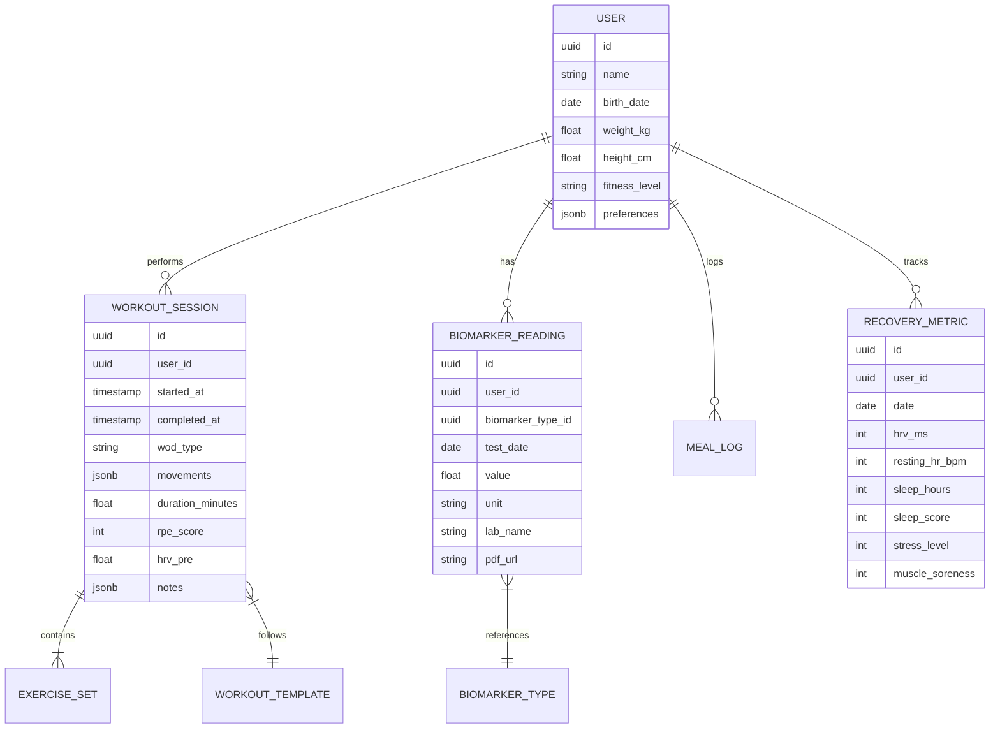

# 🏋️ CrossFit Health OS

> **Elite Human Performance Ecosystem** - Integrating Biometrics, Nutrition, and Training Intelligence

[](LICENSE)
[](https://fastapi.tiangolo.com)
[](https://supabase.com)
[](https://coolify.io)

## 🎯 Vision

CrossFit Health OS is a comprehensive performance optimization platform that leverages biometric data, adaptive training algorithms, and nutritional intelligence to create a closed-loop system for human performance enhancement.

**Built for Athletes. Powered by Data. Deployed on Coolify.**

---

## 🏗️ Architecture

### Tech Stack

| Layer | Technology | Purpose |
|-------|-----------|---------|
| **Backend** | FastAPI + Python 3.11 | High-performance API with async support |
| **Database** | Supabase (PostgreSQL) | Real-time data sync + Row Level Security |
| **Frontend** | Next.js 14 (App Router) | React-based dashboard with SSR |
| **Mobile** | PWA + Capacitor | Cross-platform native features |
| **Deployment** | Coolify | Self-hosted Docker orchestration |
| **Cache** | Redis | Session management + real-time data |
| **Storage** | Supabase Storage | Lab reports, meal photos, workout videos |
| **Queue** | Celery + Redis | Async tasks (OCR, AI recommendations) |

### System Design Principles

1. **Feedback Loop Architecture**: Biometric data → Adaptive Training → Recovery Metrics → Next Cycle
2. **Modular Services**: Each domain (training, nutrition, health) is independently deployable
3. **API-First**: All features accessible via RESTful + GraphQL APIs
4. **Real-time Sync**: Supabase Realtime for instant updates across devices
5. **Security**: Row-level security, JWT auth, encrypted health data

---

## 📁 Project Structure

```
crossfit-health-os/
├── backend/                    # FastAPI Application
│   ├── app/
│   │   ├── api/               # API endpoints
│   │   │   ├── v1/
│   │   │   │   ├── training.py      # Workout generation
│   │   │   │   ├── health.py        # Biomarker tracking
│   │   │   │   ├── nutrition.py     # Macro calculator
│   │   │   │   └── integrations.py  # HealthKit, Calendar
│   │   ├── core/              # Core business logic
│   │   │   ├── engine/
│   │   │   │   ├── hwpo_model.py    # HWPO methodology
│   │   │   │   ├── mayhem_model.py  # Mayhem programming
│   │   │   │   └── adaptive.py      # Volume adaptation
│   │   │   ├── integrations/
│   │   │   │   ├── healthkit.py     # Apple Health connector
│   │   │   │   ├── calendar.py      # Google Calendar sync
│   │   │   │   └── ocr.py           # Lab report parser
│   │   ├── models/            # Pydantic models
│   │   ├── db/                # Database schemas
│   │   │   └── supabase.py
│   │   ├── services/          # Business logic services
│   │   └── tasks/             # Celery background tasks
│   ├── tests/
│   ├── Dockerfile
│   ├── requirements.txt
│   └── pyproject.toml
│
├── frontend/                   # Next.js Dashboard
│   ├── app/
│   │   ├── dashboard/
│   │   ├── training/
│   │   ├── health/
│   │   └── nutrition/
│   ├── components/
│   ├── lib/                   # Supabase client, utils
│   ├── public/
│   ├── Dockerfile
│   ├── package.json
│   └── next.config.js
│
├── mobile/                     # PWA + Capacitor
│   ├── capacitor.config.ts
│   ├── ios/                   # Swift HealthKit integration
│   └── android/               # Kotlin Health Connect
│
├── scripts/                    # Automation Scripts
│   ├── calendar_sync.py       # Google Calendar automation
│   ├── ocr_parser.py          # Lab report PDF → JSON
│   ├── todoist_habits.py      # Habit tracker integration
│   └── seed_data.py           # Database seeding
│
├── docs/                       # Documentation
│   ├── architecture.md
│   ├── api_reference.md
│   ├── training_methodology.md
│   ├── deployment.md
│   └── healthkit_integration.md
│
├── infra/                      # Infrastructure as Code
│   ├── coolify/
│   │   ├── docker-compose.yml
│   │   └── .env.example
│   ├── supabase/
│   │   ├── migrations/
│   │   └── seed.sql
│   └── nginx/
│       └── nginx.conf
│
├── .github/
│   └── workflows/
│       ├── ci.yml
│       └── deploy-coolify.yml
│
├── docker-compose.yml          # Local development
├── .env.example
├── LICENSE
└── README.md
```

---

## 🚀 Quick Start

### Prerequisites

- Docker & Docker Compose
- Node.js 18+
- Python 3.11+
- Supabase account
- Coolify instance (for production)

### Local Development

```bash
# Clone repository
git clone https://github.com/yourusername/crossfit-health-os.git
cd crossfit-health-os

# Setup environment
cp .env.example .env
# Edit .env with your Supabase credentials

# Start services
docker-compose up -d

# Backend will be available at http://localhost:8000
# Frontend will be available at http://localhost:3000
# API docs at http://localhost:8000/docs
```

### Environment Variables

```env
# Supabase
SUPABASE_URL=https://your-project.supabase.co
SUPABASE_ANON_KEY=your-anon-key
SUPABASE_SERVICE_KEY=your-service-key

# APIs
GOOGLE_CALENDAR_CLIENT_ID=your-client-id
GOOGLE_CALENDAR_CLIENT_SECRET=your-client-secret
APPLE_TEAM_ID=your-team-id
TODOIST_API_TOKEN=your-todoist-token

# OCR
OPENAI_API_KEY=your-openai-key  # For GPT-4 Vision OCR

# Redis
REDIS_URL=redis://redis:6379/0

# Application
SECRET_KEY=your-secret-key
ENVIRONMENT=development
```

---

## 📊 Core Features

### 1. Adaptive Training Engine

**Input:** Sleep quality (HRV, RHR), Recovery score, Previous session performance  
**Output:** Dynamically adjusted workout volume and intensity

**Methodologies Supported:**
- ✅ HWPO (Hard Work Pays Off) - Mat Fraser's programming
- ✅ Mayhem Athlete - Rich Froning's methodology  
- ✅ CompTrain - Ben Bergeron's approach
- ✅ Custom hybrid models

**Weekly Periodization:**
```
Monday: Heavy Strength + Short MetCon (High CNS)
Tuesday: Gymnastics Skill + Moderate Volume
Wednesday: Active Recovery (if HRV < baseline)
Thursday: Threshold Training + Accessory
Friday: Competition Simulation WOD
Saturday: Long Chipper or Partner WOD
Sunday: Rest or Zone 2 Cardio
```

### 2. Health Dashboard

**Biomarker Tracking:**
- 🩸 Testosterone, Cortisol, Thyroid (TSH, T3, T4)
- 📈 Glucose, HbA1c, Insulin sensitivity
- 🧬 Inflammation markers (CRP, homocysteine)
- 💊 Vitamin D, B12, Iron, Ferritin
- 🫀 Lipid panel (HDL, LDL, Triglycerides)

**Features:**
- Upload lab PDF → Auto-parse with OCR
- Historical trend visualization
- Alerts for out-of-range markers
- AI-powered recommendations

### 3. Nutrition Intelligence

**Macro Calculator:**
- Zone-based (40/30/30) or custom ratios
- Periodized for training days vs rest days
- Meal timing optimization
- Pre/post-workout nutrition

**Integrations:**
- 📸 Meal photo logging with AI estimation
- 🥗 MyFitnessPal sync
- 📅 Automatic meal planning in Google Calendar

### 4. Integration Layer

**Apple HealthKit (iOS):**
- HRV, Resting Heart Rate, Sleep stages
- Workout heart rate data
- Steps, active calories

**Google Calendar:**
- Auto-schedule training blocks
- Meal windows (eating schedule)
- Recovery blocks

**Todoist/GitHub Issues:**
- Daily habit checklist
- Mobility/stretching reminders
- Supplement tracking

---

## 🗄️ Data Model

### Core Entities



### Feedback Loop Logic

```python
def calculate_training_volume(user_id: UUID, date: date) -> WorkoutVolume:
    """
    Adaptive algorithm that adjusts training based on recovery
    """
    # 1. Get recovery metrics
    recovery = get_recovery_metrics(user_id, date)
    hrv_ratio = recovery.hrv_ms / recovery.baseline_hrv
    sleep_score = recovery.sleep_score
    
    # 2. Calculate readiness score (0-100)
    readiness = (
        (hrv_ratio * 40) +           # HRV = 40%
        (sleep_score * 30) +         # Sleep = 30%
        ((10 - recovery.stress) * 20) +  # Stress = 20%
        ((10 - recovery.soreness) * 10)  # Soreness = 10%
    )
    
    # 3. Adjust volume multiplier
    if readiness >= 80:
        volume_multiplier = 1.1  # Push harder
    elif readiness >= 60:
        volume_multiplier = 1.0  # Maintain
    elif readiness >= 40:
        volume_multiplier = 0.8  # Reduce volume
    else:
        volume_multiplier = 0.5  # Active recovery only
    
    # 4. Generate workout
    base_workout = get_programmed_workout(user_id, date)
    return adjust_workout_volume(base_workout, volume_multiplier)
```

---

## 🛠️ Development

### Running Tests

```bash
# Backend tests
cd backend
pytest tests/ -v --cov=app

# Frontend tests
cd frontend
npm test

# E2E tests
npm run test:e2e
```

### Database Migrations

```bash
# Generate migration
supabase migration new <migration_name>

# Apply migrations
supabase db push

# Reset database (local only)
supabase db reset
```

### API Development

FastAPI auto-generates interactive docs:
- **Swagger UI**: http://localhost:8000/docs
- **ReDoc**: http://localhost:8000/redoc
- **OpenAPI JSON**: http://localhost:8000/openapi.json

---

## 🚢 Deployment (Coolify)

### Setup on Coolify

1. **Create New Resource** → Docker Compose
2. **Connect GitHub Repository**
3. **Configure Environment Variables** (from .env.example)
4. **Set Build Context**: `./`
5. **Deploy**

### Production Checklist

- [ ] Supabase project created
- [ ] Supabase RLS policies enabled
- [ ] Redis instance provisioned
- [ ] Environment variables configured
- [ ] SSL certificates configured (handled by Coolify)
- [ ] Backup strategy configured
- [ ] Monitoring enabled (Sentry, Grafana)

### CI/CD Pipeline

GitHub Actions automatically:
- ✅ Run tests on PR
- ✅ Build Docker images
- ✅ Deploy to Coolify on main branch push
- ✅ Run database migrations

---

## 📖 Documentation

| Document | Description |
|----------|-------------|
| [Architecture](docs/architecture.md) | System design and component interactions |
| [API Reference](docs/api_reference.md) | Complete API endpoint documentation |
| [Training Methodology](docs/training_methodology.md) | HWPO, Mayhem, CompTrain details |
| [Deployment Guide](docs/deployment.md) | Production setup on Coolify |
| [HealthKit Integration](docs/healthkit_integration.md) | iOS native integration guide |

---

## 🗺️ Roadmap

### Phase 1: MVP (Months 1-2)
- [x] Core API structure
- [ ] Supabase schema implementation
- [ ] Basic workout generation (HWPO model)
- [ ] HealthKit connector (HRV, Sleep)
- [ ] Simple dashboard UI

### Phase 2: Intelligence (Months 3-4)
- [ ] Adaptive training algorithm
- [ ] OCR for lab reports
- [ ] Google Calendar sync
- [ ] Nutrition tracking
- [ ] Mobile PWA

### Phase 3: Advanced Features (Months 5-6)
- [ ] AI workout recommendations (GPT-4)
- [ ] Community leaderboards
- [ ] Workout video library
- [ ] Advanced analytics dashboard
- [ ] Mayhem & CompTrain models

### Phase 4: Scale (Months 7+)
- [ ] Multi-coach platform
- [ ] Marketplace for custom programs
- [ ] Wearable integrations (Whoop, Oura, Garmin)
- [ ] Social features
- [ ] Mobile native apps (Swift, Kotlin)

---

## 🤝 Contributing

Contributions welcome! Please read [CONTRIBUTING.md](CONTRIBUTING.md) first.

1. Fork the repository
2. Create feature branch (`git checkout -b feature/amazing-feature`)
3. Commit changes (`git commit -m 'Add amazing feature'`)
4. Push to branch (`git push origin feature/amazing-feature`)
5. Open Pull Request

---

## 📄 License

MIT License - see [LICENSE](LICENSE) file for details.

---

## 🙏 Acknowledgments

- **Mat Fraser** - HWPO methodology inspiration
- **Rich Froning** - Mayhem Athlete programming
- **Ben Bergeron** - CompTrain principles
- **Supabase Team** - Amazing BaaS platform
- **FastAPI** - Modern Python web framework
- **Coolify** - Self-hosted deployment made easy

---

## 📬 Contact

- **Project Link**: https://github.com/yourusername/crossfit-health-os
- **Documentation**: https://docs.crossfithealthos.com
- **Discord Community**: https://discord.gg/crossfithealthos

---

**Built with 💪 by athletes, for athletes.**
